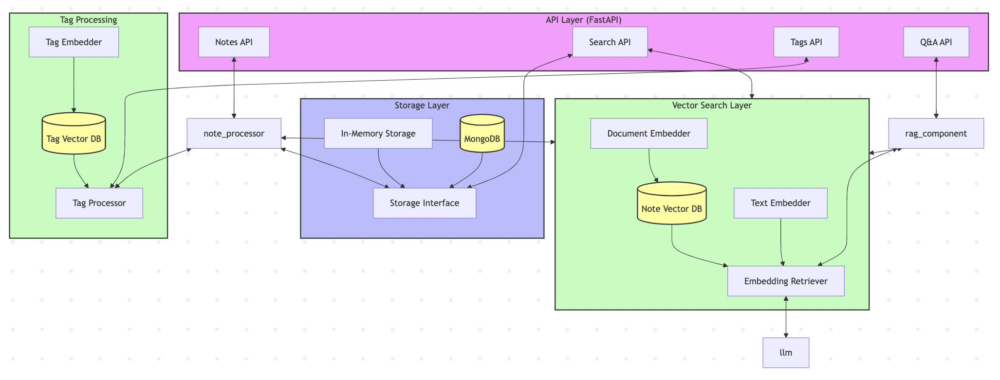
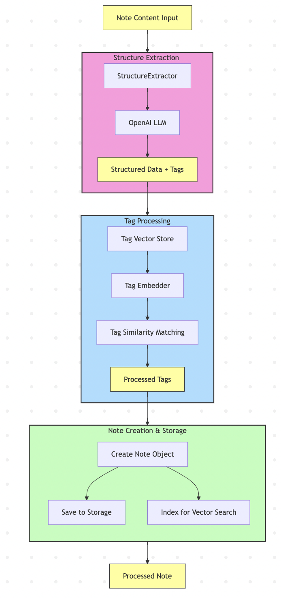

# Smart Notes API
A modern notes application with vector search, intelligent tagging, and RAG capabilities.
## Features
- Create, read, update, and delete notes
- Automatic structure extraction from notes
- Intelligent tag suggestion
- Tag similarity matching
- Vector search for semantic retrieval
- Question answering with RAG (Retrieval-Augmented Generation)

## Architecture
The application is built using:
- FastAPI - Web framework
- Haystack - Vector search and RAG pipelines. Easy to manage pipelines with many tools.
- Qdrant - Vector database. Qdrant can efficiently handle large volumes of vectors.
- MongoDB - Document storage. Saving documents with different structure.
- OpenAI

## Architecture Diagrams and Videos

### System Architecture


### Note Processing Pipeline


### Demo Videos
1. **Architecture overview**
   - [Watch Video](https://www.loom.com/share/0cbdacd356cc4b1e975c38927907d8fa?sid=1d46e635-ce5a-48ca-8ccc-7459a1b3bd3e)

2. **Run requests to API**
   - [Watch Video](https://www.loom.com/share/19cbf4625cad43f696c5124b6e9764af?sid=5469bc1a-3d61-49d9-943c-033a47261ad3)

3. **Tools overview and scalability options** - How the system leverages documents to answer questions
   - [Watch Video](https://www.loom.com/share/9d4750ee18284c3b85425cac319f9fdd?sid=d52aa592-d01c-4a85-bec3-3954d08b2da6)

## Project Structure
```
smart_notes_api/
├── app/
│   ├── **init**.py
│   ├── main.py                  # FastAPI application entry point
│   ├── models/                  # Data models
│   ├── storage/                 # Storage implementations
│   ├── search/                  # Vector search
│   ├── processing/              # Note processing pipelines
│   ├── api/                     # API routes
│   └── config.py                # Configuration
├── requirements.txt
├── Dockerfile
├── docker-compose
└── README.md
```
## Setup
### Environment Variables
```
# Storage configuration
STORAGE_TYPE=memory  # memory or mongodb
MONGODB_URI=mongodb://localhost:27017
DB_NAME=smart_notes
# Qdrant configuration
USE_IN_MEMORY_QDRANT=true
QDRANT_HOST=localhost
QDRANT_PORT=6333
# OpenAI API key for LLM features
OPENAI_API_KEY=your-api-key
# Logging and debug
LOG_LEVEL=INFO
DEBUG=false
```
### Running Locally
1. Clone the repository
2. Install dependencies: `pip install -r requirements.txt`
3. Set environment variables (create a `.env` file)
4. Run the application: `uvicorn src.main:app --reload`
### Using Docker Compose
```bash
docker-compose up -d
```
## API Endpoints
### Notes
- `POST /notes` - Create a new note
- `GET /notes/{note_id}` - Get a specific note
- `PUT /notes/{note_id}` - Update a note
- `DELETE /notes/{note_id}` - Delete a note
- `GET /notes` - List recent notes
### Search
- `POST /search/vector` - Search notes using vector similarity
- `POST /search/tags` - Search notes by tags
- `GET /search/tags` - Get all tags
### Tags
- `GET /tags` - Get all tags
- `POST /tags/process` - Process a tag through the tag vector store
### Question Answering
- `POST /qa` - Answer a question using RAG
### System
- `GET /health` - Health check
- `GET /status` - System status and component information
## Scalability Options
### Database Scaling
- MongoDB: Sharded clusters for horizontal scaling
- Implement caching for frequently accessed notes
### Vector Search Scaling
- Use full Qdrant deployment with clustering instead of in-memory storage
- Implement vector database sharding for distributed search
- Utilize sparse vector search to filter part of the values with dense search
### LLM Optimization
- Use smaller, local LLMs instead of OpenAI where applicable
